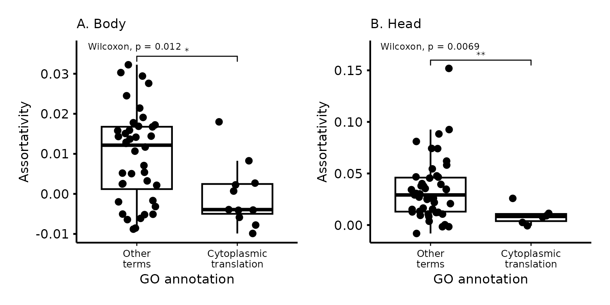

# Introduction

Gene co-expression networks inform our understanding of cell and organismal function by encoding associations between genes. Associations between expression levels can be indicative of common function, and the number of connections can be an indicator of central or regulatory genes [@Van_Dam2018-nf]. Due to the large dimensionality of gene expression data, often composed of several thousands of gene expression measures, a major tool in the analysis of co-expression is gene clustering: separating the genes into related groups, which can then be explored separately [@Dhaeseleer2005-jv]. This drastically reduces the number of genes we need to consider at the same time and allows for the identification of hubs or centrally connected genes that can be used to inform further experimental validation [@Langfelder2008-qa; @Imenez_Silva2017-ic]. 

The question is, given a co-expression network, how should we cluster the genes? The general idea behind several methods is to look for similar genes, as these are expected to be involved in related biological functions, but several definitions of similarity have been used. The most basic measure of similarity borrows from classical morphological integration theory and attempts to find gene modules based on their correlations. In this context, genes in the same module are expected to be highly correlated and perform similar functions, while genes in different modules are expected to have low correlations [@Olson1958-fh; @Magwene2001-an; @Wagner2007-jt]. Here, we refer to this classic pattern of higher within- than between-group correlation as assortativity, and to the groups as assortative modules. Other methods use the correlations to create other measures of similarity, which are then used as input to clustering algorithms. Weighted correlation network analysis [WGCNA, @Langfelder2008-qa] uses a power transformation of the correlation between gene expressions (or a topological similarity measure built with these transformed correlations) [@Zhang2005-kh; @Dong2007-ff] as a similarity measure that is then separated into assortative modules using hierarchical clustering. One of the main objectives of WGCNA is finding hub genes, which have high connectivity within modules and are clearly identified by the hierarchical clustering. Other methods borrow from network analysis and attempt to explicitly maximize the Newman Modularity [@Newman2006-fv] of the weighted gene network. For example, Modulated Modularity Clustering [MMC, @Stone2009-hv] uses an adaptive algorithm to find a non-linear distance between genes based on their correlations that maximizes the number of modules uncovered by maximizing modularity. All these methods impose an assortative structure on the gene expression network, in which similar genes are expected to be more correlated with each other than with other genes.

These clustering approaches carry important downsides. Using WGCNA involves manually tuning several parameters, and, for this tuning, the method leans heavily on the expectation that gene co-expression networks should be approximately scale-free [@Dong2007-ff; @Bergmann2004-vw; @Jeong2000-xe], but, despite its popularity, this expectation might be unwarranted [@Broido2019-hg; @Khanin2006-ve; @Stumpf2005-ed; @Keller2005-nf]. Even with optimal parameters, WGCNA fails to assign a substantial proportion of genes to any module. While WGCNA is efficient in finding hub genes, if some functional gene group does not have a hub or has low average similarities, this group will never be identified. Both limitations potentially leave biological insight on the table by ignoring network structures that are different from what the method expects. Methods that use modularity maximization, like MMC, are subject to know statistical problems, surprisingly being prone to both overfitting (finding modular community structure where there is none, @Guimera2004-jq) and under-fitting (failing to find modular structure), due to a problem known as the resolution limit, which causes small modules to be incorrectly clustered together in large networks [@Fortunato2007-ao].

The co-expression methods described above attempt to find group structure by clustering genes into assortative modules. Clustering genes in tightly correlated modules aligns with our intuition that groups of genes performing similar functions should be highly correlated, but a co-expression network does not need to be assortative and using methods that assume assortativity will necessarily ignore alternative organizations. Here, we use a more general measure of similarity that can be used to find meaningful gene groups that are not necessarily assortative but still have clear biological interpretation. To achieve this, we use a weighted nested degree corrected stochastic block model (wnDC-SBM, or SBM for brevity) [@Peixoto2017-zw; @Peixoto2018-or], which has shown promising results in similar applications (see @Baum2019-ty and @Morelli2020-ge). The SBM is different from other clustering methods in that it does not attempt to find assortative modules (i.e., modules with higher within- than between-module correlation). Instead, any information contained in the gene co-expression network can potentially be used to inform the clustering. To be sure, the SBM can capture an assortative modular pattern if it is present, but it is general enough to also capture other network organizations [@Zhang2020-up]. Even if, in the context of the SBM, assortativity is not the main driver of gene partitioning, it can still be used to interpret the clusters we obtain.

Here, using a multi-tissue RNAseq dataset from Drosophila melanogaster, we show first, that the SBM, a model with no free parameters, can find many more gene clusters than competing methods. Second, that such gene clusters are biologically meaningful as revealed by highly specific gene ontology enrichment. Third, that biological meaning is not restricted to assortative modules as traditionally thought but extends to the non-assortative parts of the transcriptome. Our results highlight the importance of using clustering algorithms that don’t rely on assortativity metrics to explore the structure of transcriptomes in a comprehensive and unbiased manner.

# Methods

## Gene expression measures

We measure gene expression using RNASeq in a large, outbred population of _D. Melanogaster_. We measure expression separately for the body and the head. 

## Gene co-expression network

Using the gene expression measures for both tissues we generate co-expression network graphs. In theory, we could proceed using a full network in which all pairs of genes are connected but fitting the SBM with this fully connected graph is computationally too expensive. So, to reduce the connectivity of the network, we impose a stringent Benjamini-Hochberg false discovery rate (FDR) cut-off on the edges, removing edges with a large p-value associated with the correlation between the corresponding genes. As edges are removed, some genes with only non-significant correlations become disconnected from the rest of the network and can be removed. By gradually reducing the FDR threshold, we reduce the density of the gene network while attempting to keep as many genes as possible, until we arrive at a viable set of genes and connections with which to fit the SBM. We chose an FDR of 1% for the head and 0.1% for the body datasets which kept most of the genes (94.2% in the head:5261, and 92.6% in the body:5124) while reducing the graph density to a manageable level for use in the SBM. This set of genes is used in the three clustering methods compared in this study: WGCNA, MMC, and SBM. 

## Edge weights

Each method uses different edge weights for the network graph. Both WGCNA and MMC can use the fully connected graph, so we maintain all edges in these methods. We use the toplogical overlap matrix (TOM) similarity in WGCNA, and the Spearman correlation derived distance in MMC. For the SBM, we use the low-density graph described above, with the edge weights given by the inverse hyperbolic tangent transformed Spearman correlations between gene expressions. This transformation allows the edge weights to be modeled by normal distributions in the SBM, as we discuss below.

## Stochastic Block Model

The Weighted Nested Degree Corrected Stochastic Block Model [@Karrer2011-vp; @Peixoto2017-zw] is a Bayesian generative model that attempts to find the partition with the highest posterior probability given the observed network and edge weights. Broadly speaking, this is achieved by dividing the network into groups of genes, called blocks, and modeling the weight and existence of a link between two genes in a network solely on their belonging to a particular block. So, genes with similar patterns of connections tend to be clustered in the same block. The degree correction refers to a modification of the standard Stochastic Block Model that allows genes with different connectivity to be clustered in the same block [see @Peixoto2017-zw for details].

If $b$ is a particular partition of the genes in the weighted gene network $A$, we write a model that generates $A$ with probability given by $P(A| b, \theta)$, where $\theta$ stands in for any extra parameter we need besides the group partition $b$. With this model, we can write the posterior probability of the block partition $b$ given the observed network:

$$
P(b|A) = \frac{P(A|\theta, b)P(\theta, b)}{P(A)}
$$

where P(A) is a normalization constant. As for the additional parameters $\theta$, the formulation used here, from @Peixoto2018-or, uses hard constraints such that there is only one choice of $\theta$ that is compatible with $A$ and $b$, which means that the model has no free parameters. We can then search for the partition ($b$) that maximizes $P(b|A)$ using computational methods, like Markov Chain Monte Carlo (MCMC) methods.

### Description length

The posterior probability of the block partition can be written as:

$$
P(b|A) \propto \exp(-\Sigma)
$$

Where $\Sigma = -log[P(A|\theta, b)] - log[P(\theta,b)]$ is called the description length of the gene network $A$, and has an information-theoretic interpretation, being the amount of information required to encode the network given $\theta$ and $b$. So, finding the partition that maximizes the posterior probability is the same as minimizing the description length, or, in other words, the chosen partition $b$ is the one that allows us to describe the network using the least information. 

The two terms in $\Sigma$ also allow us to understand why this method offers intrinsic protection against overfitting. The first term $log[P(A|\theta, b)]$ corresponds to the log-likelihood of the observed network. Increasing the number of blocks allows this likelihood to increase as the degrees of freedom of the model increase. But, the second term, $log[P(\theta,b)]$ functions as a penalty that increases for complex models with many blocks, and the description length cannot decrease for overly complex models that have more blocks than warranted by the data. So, the selected partition with the minimum description length will necessarily be the simplest partition with similar explanatory power, avoiding overfitting and fully using the available statistical evidence. For example, the SBM would not detect modules that appear in random networks due to statistical fluctuations, in contrast to modularity maximization, which finds spurious modules in random networks [@Guimera2004-jq; @Zhang2020-up]. We can also use the description length as a principled method for comparing models that simultaneously considers fit to data and model complexity.

### Weighted SBM

The weights on the edges can be modeled in the SBM using different distributions depending on the edge weights. When edge weights are correlations, which are continuous numbers that vary between -1 and 1, it is natural to use some transformation to map the correlations onto the real numbers. To do this, we use arctanh transformed correlations as the edge weights and model these weights using normal distributions. In the SBM, the weights are modeled in much the same way as the links between networks, in that the mean and the variance of the observed edge weights between two blocks are a function only of the block structure, i.e., genes in the same block have a similar probability of being connected to other genes and the value of the weights in these edges comes from the same distribution.

### Nested SBM

The nested SBM uses a series of non-parametric hierarchical priors that greatly increase the resolution of block partition. This nested structure allows for the identification of more and smaller blocks that are statistically supported than other clustering methods [@Peixoto2017-zw]. This is achieved by treating the gene block partition as the nodes in a nested series of networks, which are then clustered using the same method. So, the genes are clustered in blocks, and these blocks are also clustered in higher-level blocks, and so on, as required to minimize the description length of the gene network (see diagram in @fig:SBM_diagram). The model estimates the number of levels in the hierarchy and the number of blocks in each level. Since the model is generative, we can use posterior samples of the partitions to quantify the uncertainty in any quantity estimated by the model, like the number of levels in the hierarchy, or the number of blocks at each level. For details on the implementation of the SBM, see [@Peixoto2017-zw] and [@Peixoto2018-or]. All SBM were fitted using the graph-tool python library [@peixoto_graph-tool_2014]. 

![Schematic representation of the clustering in the SBM. Genes are clustered into level-1 blocks, level-1 blocks are clustered into level-2 blocks, and so on. A. Circular representation of the clustering we use in the following figures. Block names are constructed by following the hierarchy, starting at level 1. So in this example, the level-1 block 8 can also be referred to as 8-4-1. B. A tree-like representation that highlights the hierarchy in the nested SBM. Each level-2 block is composed of all the genes in its child level-1 blocks, each level-3 block is composed of all the genes in its child level-2 blocks, and so on.](figures/SBM_diagram.png){#fig:SBM_diagram height=10cm}

### Modularity and Assortativity

Although the nested SBM does not attempt to find the partition of genes that maximizes modularity (see definition below), when using this method we can ask if the inferred partition is modular or not by calculating the Newman modularity at each level of the hierarchy. Newman Modularity is calculated at each nested level using:

$$
M = \frac{1}{2E} \sum_r e_{rr} - \frac{e_{r}^2}{2E}
$$

where $e_{rs}$ is the sum of edge weights between groups $r$ and $s$, $e_{r} = \sum_s  e_{rs}$ and $E$ is the sum of all weights. Newman modularity quantifies the intuition that genes in the same module should be more connected than across modules by comparing the within-group connections ($e_{rr}$) to the expected value of the connections across all the groups ($\frac{e_{r}^2}{2E}$). The higher the difference between correlations within- and between-groups, the higher the value of $M$.

We further decompose the contribution of each Level-1 block to the modularity by defining the assortativity of a block as:

$$
q_r = \frac{B}{2E} \left ( e_{rr} - \frac{e_{r}^2}{2E} \right )
$$

where $B$ is the number of blocks. Using this definition, modularity is just the average assortativity, $M = \frac{1}{B} \sum_r  q_r$, and modules with positive assortativity contribute to increasing modularity, while blocks with negative assortativity decrease it. Assortativity values vary between -1 for a fully non-assortative block (all edges are to other blocks), and 1 for a fully assortative one (all edges are internal to the block).

## WGCNA and MMC

We use WGCNA to cluster the genes into modules using the topological overlap measure (TOM) similarity with a soft threshold of 6 in a signed similarity measure. WGCNA produces modules by cutting the hierarchical clustering tree at different heights, and we use the dynamic cutting option to create the modules. We use a signed network (as opposed to ignoring the sign of the correlation between genes) because inspection of the gene network graph reveals large groups of genes linked by negative correlations in our data, suggesting a large-scale structure that would be obscured by using the unsigned method. Signed similarity has been shown to lead to more robust modules [@Mason2009-ej], and in tuning WGCNA we were able to cluster more genes and find more modules using the signed method. MMC has no option to use the sign of the correlation, so we use the absolute value of the Spearman correlations.

## Gene Ontology enrichment

We assess the biological relevance of the clustering obtained by each method by comparing their gene ontology (GO) enrichment. We filter enrichment using a Benjamini-Hochberg FDR rate of 5\%, with a minimum of 4 genes in the enriched set. All gene ontology analyses were done using the clusterProfiler R package v4.2.2 [@Wu2021-db] and the Org.Dm.eg.db database package v3.15 [@godb].

# Results

## Gene clustering

Gene clustering for all methods is presented in Supporting Information Table S1. Using the SBM, in both head and body, we were able to cluster all genes, identifying a nested partition with 5 levels, with 2 blocks at level 5 (the coarsest), 3 blocks at level 4, 6 (head) and 9 (body) in level 3, 21 (head and body) at level 2, and 82 (head) and 78 (body) at level 1. The block structure inferred by the SBM is shown in @fig:Emats. In what follows, when discussing specific SBM blocks, we either explicitly define which level of the nested hierarchy we are referring to or give the full path to a given block. So, level-1 block 12 in the head can also be referred to as 12-7-2-2-1, and level-2 block 10 in the body is also 10-1-2-1 (see @fig:SBM_diagram for an example). 

![Matrix and graph representations of the SBM clustering. A and B: SBM Level-1 blocks are colored by the number of edges within and between blocks. Gray squares represent pairs of unconnected blocks. The upper levels of the nested hierarchy are shown by the red lines. C and D: A full representation of the fitted block model. Genes are shown at the perimeter, colored by their level 2 blocks. The internal graph shows the hierarchical structure of the fitted SBM. Numbers in blue circles correspond to the level-2 block. Arrows between level-1 blocks and genes are omitted, unlike fig. 1. A subsample of 30.000 edges is shown connecting the genes, and edges are colored according to their weights, with more positive weights plotted on top. External labels refer to a non-exhaustive subset of level-2 blocks with clear biological function inferred from interpreting GO enrichment. Level-2 block 8 in the body, with the label highlighted in red, is the only level-2 block with no GO enrichment.](figures/SBM_Ematrix.png){#fig:Emats}

WGCNA partitioned 2118 genes (~40% of genes) into 7 modules in the body and 1600 genes (~30% of genes) into 7 modules in the head. WGCNA did not cluster 3006 genes in the body and 3661 in the head. Given that the number of modules in WGCNA is similar to the number of blocks at level 3 of the SBM, we compare these two partitions in @fig:wgcna_compare. Overall, the partitions are different, but there are some common patterns. For example, Level-3 blocks 0, 2, 5, and 6 in the body are split between modules 3 and 4, and these blocks are all in the same Level-4 block 0, suggesting some similarity that could explain the WGCNA clustering. Blocks 7 and 9 are both fully assigned to module 2. Also in the body genes, we find a similar pattern for Level-3 blocks 1, 3, and 4, which are mostly split between modules 1 and 2. In the head, Level-3 block 4 is all assigned to modules 1 and 3. Level-3 blocks 1 and 2 are mostly split between modules 1 and 3, and both are in Level-4 block 2. So, while the clustering is different, WGCNA and the SBM do capture some common signals.

MMC failed to cluster most genes, placing almost all genes into the same large module. Given this poor performance on our data, we do not discuss MMC further and instead focus on comparing SBM to WGCNA.

{#fig:wgcna_compare}

## Modularity and assortativity

Modularity and assortativity are markedly lower in the body (@fig:modularity). Several blocks in the body have negative assortativity, and the maximum value of modularity is 0.035 at level 4 of the nested hierarchy. Even so, several blocks show GO enrichment throughout the distribution of assortativity. In the head, modularity is overall higher, with a peak at 0.14 in level 3. This is still a relatively low value and illustrates how assuming the gene network should be modular can prevent us from finding an informative clustering. All but 5 blocks in the head show positive assortativity, and again GO enrichment is present throughout the assortativity range. 

![Assortativity measured in the SBM level-1 blocks and Newman Modularity (average assortativity) at each level of the SBM hierarchy (inset). GO enriched blocks are shown in yellow and appear throughout the distribution of assortativity. Modularity is much higher in the head, and it peaks at level 3, dropping in upper levels. Body has a much higher number of non-assortative blocks and lower modularity at all levels. Modularity peaks at level 4 in the body and drops strongly at level 5. Interestingly, the 4 most assortative blocks in the body do not show significant GO enrichment.](figures/assortativity.png){#fig:modularity}

## Gene Ontology enrichment

Most blocks in SBM show some level of GO enrichment (Table 1). In particular, several of the Level-2 blocks show a remarkable consistency in their enrichment. For example, Level-3 block 0 in the head is related to neural signaling, sensory perception, and signal transduction. When we go finer, we see that often the daughter blocks at Level-2 are also enriched with generally similar terms, as expected, but these tend to become more specific as we go down the hierarchy. For example, Level-2 blocks 4 and 6: (4-0-0-0) G protein-coupled receptor signaling pathway, detection of light stimulus, phototransduction; (6-0-0-0) synapse organization, axon development, cell-cell signaling, behavior. Many of these enrichments are exclusive to one of the level-1 blocks. Perhaps the most surprising enrichment is for the blocks associated with translation, in which all of the ribosomal proteins are clustered almost exclusively in level-1 blocks in both tissues. Most other Level-2 and Level-1 blocks are readily identifiable as related to development, DNA transcription, cell respiration, cell cycle regulation, immune response, sugar metabolism, among others (@fig:Emats). All WGCNA modules show GO enrichment (but modules 5, 6, and 7 in the body show only one or two enriched terms). Supporting Information Table S2 shows GO enrichment for all SBM blocks and WGCNA modules. 

  Tissue     Level 1          Level 2           Level 3        Level 4     Level 5
--------    --------------   ---------------  ------------- ------------- -------------
Head         65\% (53/82)     100\% (21/21)    100\% (6/6)   100\% (3/3)   100\% (2/2)
Body         65\% (51/78)     95\% (20/21)     100\% (9/9)   100\% (3/3)   100\% (2/2)
      
Table: Number of blocks at each level of the SBM hierarchy that show significant GO enrichment at the 5\% FDR level with a minimum of 4 genes in the enriched set.

{#fig:go_map}

### Notable individual clusters

Level 2 block 0-0-0 in the head is one of the easiest to interpret, being entirely related to nervous tissue function. @Fig:go_map shows the top 8 GO categories for each of the level-1 blocks in block 0-0-0, and the most neuronal enriched WGCNA grouping, module 4. The SBM blocks separate vesicle exocytosis, neuronal differentiation, phototransduction, synaptic signaling, and, interestingly, there is a block related to mRNA processing, which is notable given that alternative splicing is thought to be more common in brain tissues [@Su2018-nz]. WGCNA module 4 recovers some of this enrichment but in a less granular way. The cell adhesion and developmental part of the enrichment in block 0-0-0 is separated between WGCNA modules 4 and 5. Some of the level-1 blocks shown in @fig:go_map are among the most assortative (above 0.03, see @fig:modularity B), and so are prime candidates for detection in WGCNA. The alternative splicing module has a much lower assortativity, so it is not surprising that WGCNA could not detect it.

Some of the most specific enrichments in the SBM are the translation-related blocks. In both body and head, ribosomal proteins are clustered in small and highly enriched level-1 blocks: 6 level-1 blocks in the head and 11 in the body are composed of virtually only ribosome-related protein genes. All are very small, being composed of between 10-30 genes, have low assortativity (@fig:assort_translation), and are enriched for very few terms, almost all related to translation. In the body, all of these translation blocks are grouped in level-4 block 1; in the head, they are split between level-4 blocks 1 and 2. Both groups are visible in @fig:Emats . There is no equivalent module in WGCNA, but all of the translation-related genes are in the same much larger modules (module 2 in the head, 295 genes; and module 2 in the body, 345 genes), both of which show enrichment for translation but also several other categories. In the body WGCNA module 2, we see 68 enriched terms related to translation, cell respiration, and several small molecules' metabolic processes; in module 2 of the head tissue, we see 35 enriched terms related to translation, cell respiration, and muscle development. The level-2 clustering of level-1 blocks in the SBM is also informative. In the head, all of the translation level-1 blocks are in their own level-2 blocks (8-4-1-1, 7-2-2-1, and 2-2-2-1). In contrast, in the body, the level-1 translation blocks sometimes share level-2 blocks with cell respiration blocks: 1-7-1-1 is composed exclusively of level-1 blocks related to translation, but block 14-9-1-1 is split into translation and mitochondrial respiration level-1 blocks. WGCNA also places cell respiration-related genes in the body on the same module 2.

{#fig:assort_translation}

# Discussion

Traits in an organism need to have some level of integration, of interdependence, to form a functioning individual. This necessary interaction between parts poses an important problem for understanding the evolution of complex traits, as inter-dependencies are expected to lead to important evolutionary restrictions [@Orr2000-gn]. Modularity, relative independence  between groups of complex traits, provides a simple solution to this problem as it allows organisms to maintain their function unchanged by coordinating simultaneous evolutionary changes in all related traits while keeping unrelated traits undisturbed [@Ancel2000-vt; @Cheverud1996-jw; @Wagner2011-zx; @Wagner1996-ui]. The explanatory power of modularity as a unifying concept at several levels of organization has led to its use in different fields with great success [@Melo2016-yw; @Zelditch2021-ue; @Wagner2007-jt], and there is no doubt that there are many biological systems that are indeed modular. This general usefulness has also informed much of our thinking on how complex traits should be structured, producing a large literature dedicated to finding modules and testing for their existence. Morphological traits being organized into modules can be interpreted as a consequence of the very concrete structural and developmental constraints that lead to the formation and allow proper functioning of these individual body elements [@Shirai2010-co; @Marcucio2011-nq], even if local integrating processes are not always detectable in the final trait covariance structure [@Hallgrimsson2009-yd; @Mitteroecker2007-xq]. No such clear structural imposition exists on gene expression, and the interaction between groups of genes can happen through much more dynamic and varied mechanisms. Furthermore, modularity is not a necessary feature of biological organization [even in the case of evolvability, see @Pavlicev2011-xm; @Roseman2009-kk], and only searching for modularity can blind us to alternative organizations. Indeed, the profound interconnectedness of gene regulation networks has led to a small revolution in our understanding of disease and complex traits [@Boyle2017-re].

Here, we use an alternative method of clustering to show that assortativity need not be the main driver of biologically meaningful clustering of complex traits. Using the Stochastic Block Model, which clusters genes so as to capture as much information on the network of interactions as possible, we find a large number of biologically relevant groups that could not be uncovered by methods that assume assortative modules. The blocks related to protein translation illustrate this nicely, with clear biological interpretation and practically no assortative modularity. This shifts our view of the structure of the relations between traits: instead of assuming the network is modular and clustering genes based on this assumption, we uncover clusters based on their information content about the gene network and ask if the resulting groups are assortative. Surprisingly, the answer is not always. We find assortative and non-assortative modules and a marked difference in the overall modularity in the co-expression networks of two tissues. 

There are also several practical advantages offered by the SBM. The non-parametric nature of the method means there are no free parameters to be optimized using heuristics, and other implementation choices, like the exact choice of edge weights, can be made in a principled fashion using the description length [@Peixoto2017-zw]. Also, the SBM finds a much larger number of modules that are guaranteed to be statistically supported, greatly improving the resolution of the clustering and allowing for more precise biological interpretation of the resulting blocks. The hierarchical nature of the model also allows for more or less coarse-graining of the clustering, as illustrated by the signaling-related block in @fig:go_map. This combination of smaller and more numerous blocks with the hierarchical structure of the nested SBM is especially well suited for guilt-by-association analysis, as it allows for the use of contextual information given by the hierarchy when making precise inferences about unannotated genes in small blocks. We could also go further in interrogating the posterior distribution of block assignments and use this distribution to quantify the confidence level of the grouping of particular genes or blocks. While we have not explored the statistical side of the SBM here, there is ample space for using the SBM as a theoretically well-supported statistical tool in gene expression clustering. Biology has a history of borrowing methods and insight from other fields for answering biological questions [@Radde2016-an; @Mason2007-ou; @Proulx2005-da]. Network analysis has come a long way since modularity maximization [@Peixoto2021-pp], and the gene expression and modularity community should continue this rich tradition by porting recent advancements from network theory, like the SBM, into our toolkit.

\footnotesize

## Supporting information 

Supporting information can be found at [https://github.com/diogro/SBM_manuscript](https://github.com/diogro/SBM_manuscript).

# References

