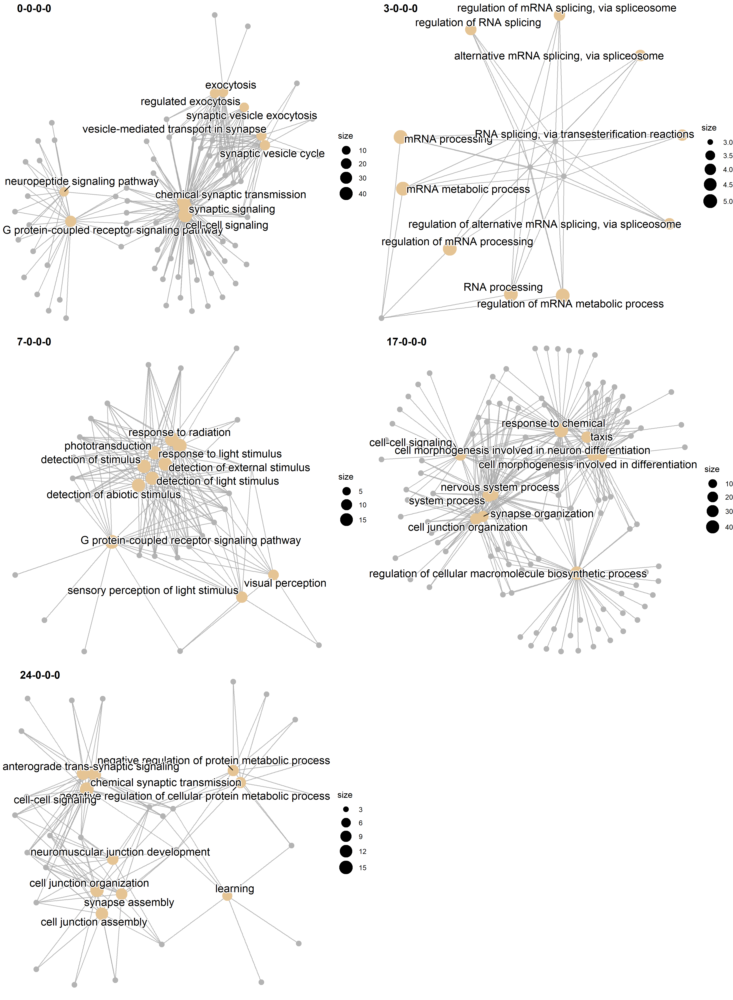

# Intro

Gene co-expression networks allow for the associations between genes to inform our biological understanding of cell and organismal function. Associations between gene expressions can be indicative of common function, and the number of connections can be an indicator of central or regulatory genes [@Van_Dam2018-nf]. Due to the large dimensionality of gene expression data, often composed of several thousands of gene expressions, one major tool in the analysis of co-expression is gene clustering: separating the genes into related groups, which can then be explored separately [@Dhaeseleer2005-jv]. This drastically reduces the number of genes we need to consider at the same time, and allows for the identification of hubs or centrally connected genes that can then be used to inform further experimental  validation [@Langfelder2008-qa; @Imenez_Silva2017-ic]. 

The question is, given a co-expression network, how should we cluster the genes? The general idea behind several methods is to look for similar genes, as these are expected to be involved in related biological functions, but several definitions of similarity have been used. The most basic measure of similarity borrows from classical morphological integration theory, and attempts find gene modules based on their correlations. In this context, genes in the same modules are expected to be highly correlated and perform similar functions, while genes in different modules are expected to have low correlations [@Olson1999-fh; @Magwene2001-an; @Wagner2007-jt]. Other methods use the correlations to create other measures of similarity, which are then used as inputs to clustering algorithms. Weighted correlation network analysis [WGCNA, @Langfelder2008-qa] uses a power transformation of the correlations between genes expressions (or a topological similarity measure built with these transformed correlations) [@Zhang2005-kh; @Dong2007-ff] as a similarity measure that is then separated into modules using hierarchical clustering. One of the main objectives of WGCNA is finding hub genes, which have high connectivity withing modules and are clearly identified by the hierarchical clustering. Other methods borrow from network analysis and attempt to explicitly maximize the Newman Modularity [@Newman2006-fv] of the weighted gene network. Modulated Modularity Clustering [MMC, @Stone2009-hv] uses an adaptive algorithm to find a non-linear distance between genes based on their correlations that maximizes the number of modules. All these methods impose a modular structure on the gene expression network, where similar genes are expected to be correlated with each other. 

All of these approaches come with several downsides. WGCNA involves manually tunning several parameters, and for this the method leans heavily on the expectation that gene co-expression networks (and biological networks in general) should be approximately scale-free [@Dong2007-ff; @Bergmann2004-vw; @Jeong2000-xe], but, despite its popularity, this expectation might be somewhat unwarranted [@Khanin2006-ve; @Stumpf2005-ed]. Even with optimal parameters, WGCNA fails to assign a substantial proportion of genes to any module. While WGCNA is efficient in finding hub genes, if some functional gene group does not have a hub or has low average similarities, this group will never be identified. Both limitations potentially leave biological insight on the table by ignoring network structures that are different from what the method expects. Methods that use modularity maximization, like MMC, are subject to know statistical problems, surprisingly being prone to both overfitting (finding modular community structure where there is none [@Guimera2004-jq]) and under-fitting (failing to find modular structure in large networks, due to a problem know as the resolution limit [@Fortunato2007-ao]). 

Here, we propose that a more general measure of similarity, which is not restricted to high correlated genes, can be used to find meaningful genes groups, with high correlation between groups and biological function. To achieve this, we use a weighted nested degree corrected stochastic block model (wnDC-SBM, or SBM for brevity) [@Peixoto2017-zw; @Peixoto2018-or]. The co-expression methods described above attempt find group structure by clustering genes into assortative modules: groups of genes that are more associated with each other than with other genes. Clustering genes in tightly correlated modules aligns with our intuition that groups of genes performing similar functions should be highly correlated, but it is not necessary for a network to be organized in this assortative fashion, and so using methods that assume assortativity will necessarily ignore alternative organizations. The SBM is different from other clustering methods in that it does not attempt to find assortative modules. Instead, any information brough by the structural similarity between genes in the network can potentially be used to inform the clustering. To be sure, the SBM can capture an assortative modular pattern if it is present, but it is general enough to also capture other network organizations [@Zhang2020-up]. While in the context of the SBM assortativity is not the main driver of the clustering, it can be used to interpret the partitioning we obtain from the clustering. We show that a SBM, a model with no free parameters, can find many more meaningful blocks than competing methods, as revealed by highly specific gene ontology enrichment, and show that the expected assortativity of biologically meaningful blocks is not necessarily present.

# Methods

## Gene expression measures

We measure gene expression using RNASeq in a large, outbred population of D. Melanogaster. We measure expression separately for the body and the head. 

## Gene selection

Using the gene expression measures for both tissues we generate co-expression network graphs. In theory, we could proceed using a full network in which all pairs of genes are connected but fitting the SBM with this fully connected graph is computationally too expensive. So, to reduce the size and connectivity of the network, we impose a stringent Benjamini-Hochberg false discovery rate (FDR) cut-off on the edges, removing edges with a large p-value associated with the correlation between the corresponding genes. As edges are removed, some genes with only non-significant correlations become disconnected from the rest of the network and can be removed. By gradually reducing the FDR threshold, we reduce the size and density of the gene network, until we arrive at a viable set of genes and connections with which to fit the SBM. After some experimentation, we decided that an FDR of 1e-4 for the head and 1e-5 for the body kept a large number of genes (head:3589, body:3253) and allowed us to fit the SBM in days instead of weeks. This set of genes is used in all the different clustering methods. 

## Edge weights 

Each method uses different edge weights for the network graph. Both WGCNA and MMC can use the fully connected graph, so we maintain all edges in these methods. We use the TOM similarity in WGCNA, and the Spearman correlation derived distance in MMC. For the SBM, we use the low-density graph described above, with the edge weights given by the inverse hyperbolic tangent transformed Spearman correlations between gene expressions. This transformation allows the edge weights to be modeled by normal distributions in the SBM, as we discuss bellow.

## Stochastic Block Model

The Weighted Nested Degree Corrected Stochastic Block Model [@Karrer2011-vp; @Peixoto2017-zw] is a Bayesian generative model that attempts to find the partition with the highest posterior probability given the observed network and edge weights. Broadly speaking, this is achieved by dividing the network into groups of genes, called blocks, and modeling the weight and existence of a link between two genes in a network solely on their belonging to a particular block. So, genes with similar patterns of connections tend to be clustered in the same block. The degree correction refers to a modification of the standard Stochastic Block Model that allow genes with different connectivity to be clustered in the same block [see @Peixoto2017-zw for details].

If $b$ is a particular partition of the genes in the weighted gene network $A$, we write a model that generates $A$ with probability given by $P(A| b, \theta)$, where $\theta$ stands in for any extra parameter we need besides the group partition $b$. With this model, we can write the posterior probability of the block partition $b$ given the observed network:

$$
P(b|A) = \frac{P(A|\theta, b)P(\theta, b)}{P(A)}
$$

where P(A) is a normalization constant. As for the additional parameters $\theta$, the formulation used here, from @Peixoto2018-or, uses hard constraints such that there is only one choice of $\theta$ that is compatible with $A$ and $b$, which means that the model has no free parameters. We can then search for the partition $b$ that maximizes $P(b|A)$ using computational methods, like Markov Chain Monte Carlo (MCMC) methods.

### Description length

The posterior probability of the block partition can be written as:

$$
P(b|A) \propto \exp(-\Sigma)
$$

Where $\Sigma = -log[P(A|\theta, b)] - log[P(\theta,b)]$ is called the description length of the gene network $A$, and has an information theoretic interpretation, being the amount of information required to encode the network given $\theta$ and $b$. So finding the partition that maximizes the posterior probability is the same as minimizing the description length, or, in other words, the chosen partition $b$ allows us to describe the network using less information. 

The two terms in $\Sigma$ also allow us to understand why this method offers an intrinsic protection against overfitting. The first term $log[P(A|\theta, b)]$ corresponds to the log likelihood of the observed network. Increasing the number of blocks allows this likelihood to increase as the degrees of freedom of the model increase. But, the second term, $log[P(\theta,b)]$ functions as a penalty that decreases for complex models with many blocks, and the description length cannot decrease for overly complex models that have more blocks than warranted by the data. So, the selected partition with the minimum description length will necessarily be the simplest partition with similar explanatory power, avoiding overfitting and fully based on the available statistical evidence. For example, he SBM would not detect modules that appear in random networks due to statistical fluctuations [@Guimera2004-jq; @Zhang2020-up]. We can also use the description length as a principled method for comparting models that simultaneously considers fit to data and model complexity.

### Weighted SBM

The weights on the edges can be modeled in the SBM using several different distributions. When using correlation, which are continuous numbers that vary between -1 and 1, it is natural to use some transformation to map the correlations onto the real numbers. To do this, we use arctanh transformed correlations as the edge weights and model these weights using normal distributions. In the SBM, the weights are modeled in much the same way as the links between networks, in that the the mean and the variance of the observed edge weights between two blocks are a function only of the block structure, i.e., genes in the same block have a similar probability of being connected to other genes and the value of the weights in these edges come from the same distribution.

### Nested SBM

The nested SBM uses a series of non-parametric hierarchical priors that greatly increase the resolution of block partition. This nested structure allows for the identification of more and smaller blocks that are statistically supported than other clustering methods [@Peixoto2017-zw]. This is achieved by treating the gene block partition as the nodes in a nested series of networks, which are then clustered using the same method. So, the genes are clustered in blocks, and these blocks are also clustered in a higher-level blocks, and so on, as required to minimize the description length of the gene network. The model estimates the number of levels in the hierarchy and the number of blocks in each level. Since the model is generative, we can use posterior samples of the partitions to quantify error in any quantity estimated by the model, like the number of levels in the hierarchy, or the number of blocks at each level. For details in the implementation of the SBM, see [@Peixoto2017-zw] and [@Peixoto2018-or]. All SBM were fit using the graph-tool python library [@peixoto_graph-tool_2014]. 

### Modularity and Assortativity

Instead of attempting to maximize modularity, when using the nested SBM we can ask if the inferred partition is modular or not by calculating the Newman modularity at each level of the nested hierarchy. Modularity is calculated at each nested level using:

$$
M = \frac{1}{2E} \sum_r e_{rr} - \frac{e_{r}^2}{2E}
$$

where $e_{rs}$ is the sum of edge weights between groups $r$ and $s$, $e_{r} = \sum_s  e_{rs}$ and $E$ is the sum of all weights. We further decompose the contribution of each Level-1 block to the modularity, by defining the assortativity of a block as:

$$
q_r = \frac{B}{2E} \left ( e_{rr} - \frac{e_{r}^2}{2E} \right )
$$

where $B$ is the number of blocks. Using this definition, $M = \frac{1}{B} \sum_r  q_r$, and modules with positive assortativity contribute to increasing modularity, while blocks with negative assortativity decrease it. Assortativity values vary between -1 for fully disassortative block and 1 for a fully assortative one.

## WGCNA and MMC

We use WGCNA to cluster the genes into modules using the topological overlap measure (TOM) similarity with a soft threshold of 6 in a signed similarity measure. WGCNA produces modules by cutting the hierarchical clustering tree at different heights, and we use the dynamic cutting option to create the modules. We use a signed network (as opposed to ignoring the sign of the correlation between genes) because inspection of the gene network graph reveals large blocks of correlations linked by negative correlations in our data, suggesting large scale structure that would be obscured by using the unsigned method. Unsigned similarity has been shown to lead to more robust modules [@Mason2009-ej], and the SBM can use the sign of the correlation in the clustering. MMC has no option to use the sign of the correlation, so we use the absolute value of the Spearman correlations.

## Gene Ontology enrichment

We assess the biological relevance of the clustering obtained by each method by comparing their gene ontology (GO) enrichment. We filter enrichment using a Benjamini-Hochberg FDR rate of 5\%, with a minimum of 4 genes in the enriched set. We ran GO in all identified clusters using R packages ClusterProfiler [@Yu2012-tz] and the online tool GOrilla [@Eden2009-qs].

# Results

## Clustering

Gene clustering for all methods is presented in table S1. Using the SBM, in both head and body we identified a nested partition with 4 levels, with 2 blocks at level 4 (the coarsest), 5 (head) and 4 (body) in level 3, 13 (head) and 14 (body) at level 2, and 56 (head) and 57 (body) at level 1. The block structure inferred by the SBM is shown in fig. @fig:Emats. In what follows, when discussing specific SBM blocks, we either explicitly define which level of the nested hierarchy we are referring to, or give the full path to a given block. So, level-1 block 12 in the head can also be referred as 12-0-0-0, and level-2 block 10 in the body is also 10-2-2. 

{#fig:Emats}

WGCNA partitioned 2717 genes into 9 modules in the body and 2032 genes into 8 in the head. WGCNA did not cluster 536 genes in the body and 1557 in the head. Given that the number of modules in WGCNA is somewhat similar to the number of blocks at level 2 of the SBM, we compare these two partitions in fig. @fig:wgcna_compare. Overall, the partitions are different, but there are some common patterns. For example, Level-2 blocks 0, 2 and 6 in the body are split between modules 1 and 4, and these blocks are all in the same Level-3 block 0, suggesting some similarity that could explain the WGCNA clustering. Also in the body genes, we find a similar patter for Level-2 blocks 3, 4 and 5, which are split between modules 2 and 3. In the head, Level-2 block 2 is all assigned to module 1. Level-2 blocks 0 and 12 are split between modules 4 and 6, and both are in Level-3 block 0. So, while the clustering is different, WGCNA and the SBM do capture some common signal.

{#fig:wgcna_compare}

### Gene Ontology enrichment

The majority of blocks in SBM show some level of GO enrichment (Table 1). In particular, several of the Level-3 blocks show a remarkable consistency in their enrichment. For example, Level-3 block 0 in the head is related to neural signaling and sensory perception, with its daughter blocks at Level-2 (0 and 12) showing enrichment for: (Level-2 0) signal transduction, synapse organization, nervous system process, phototransduction, G protein-coupled receptor signaling pathway (12) neural development,  trans-synaptic signaling, behavior. Several of these enrichments are exclusive to one of the level-1 blocks. Perhaps the most surprising enrichment is for the blocks associated with translation, in which all of the ribosomal proteins are clustered almost exclusively in level-1 blocks in the body and in the head. Several other Level-2 and Level-1 blocks are readily identifiable as related to development, DNA transcription, cell respiration, cell cycle regulation, immune response. 

The SBM is also able to capture exceedingly faint biological signals. For example, level-1 blocks 55 in the head and 31 in the body are similar in that they are visibly less connected to the rest of the blocks, as we can see in fig. @fig:Emats. They are both very small, being composed of 17 and 10 genes, respectively. This similarity in confirmed by the common GO enrichment for both blocks (immune response) and some common genes (Dpt - diptericin, Dro - drosocin).

  Tissue     Level 1          Level 2             Level 3    Level 4
--------    --------------   -----------------  ----------- -----------
head         66\% (37/56)     100\% (13/13)     100\% (5/5)  100\% (2/2)
body         68\% (39/57)     92\%  (13/14)     100\% (4/4)  100\% (2/2)
      
Table: Number of blocks at each level that show significant GO enrichment at the 5\% FDR level with a minimum of 4 genes in the enriched set.

{#fig:go_map}

\newpage

### Modularity and assortativity

Modularity and assortativity are markedly lower in the body (fig. @fig:modularity). Several blocks in the body have negative assortativity, and the maximum value of modularity is 0.04 at level 2 of the nested hierarchy. Even so, several blocks show GO enrichment across the distribution of assortativity. In the head, modularity increases at coarser levels of the nested hierarchy, with a peak at 0.3 in level 4. This is still a relatively low value, and illustrates how assuming the gene network should be modular can prevent us from finding an informative clustering. Most blocks in the head show positive assortativity, and again GO enrichment is present across the range. 

{#fig:modularity}

\newpage

# Discussion

- SBM recovered many more blocks and with more specific enrichment.
- No relation between assortativity and enrichment, several of the uncovered blocks are non-assortative.
- WGCNA and MMC fail to recover several clear blocks in SBM, like the neuro blocks in the head and the translation blocks in both tissues.
- SBM also reveals other biological insights, like the association between translation and cell respiration in the body.
- Imposing more structure than is warranted may be preventing us from extracting meaningful information from gene expression networks.

\newpage

# References

